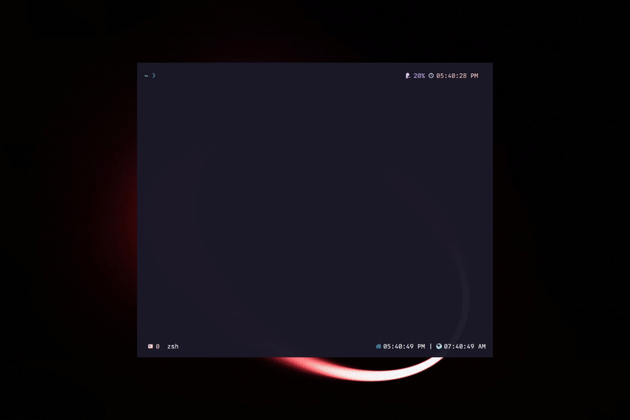

# Alacritty Themes

## Demo



CLI Theme switcher for [Alacritty](https://github.com/alacritty/alacritty) terminal emulator

- ❗ Currently supporting TOML configurations **ONLY**
- 🎨 600+ Themes to choose from
- ⤵️ It inserts an import line for theme file, so you can easily have color keys to customize and override in `alacritty.toml`

## Install

1. Clone the repo or download as .zip and copy `colors` folder into your root alacritty config directory `eg. ~/.config/alacritty/colors`
2. Install package from npm

Globally

```sh
npm i -g @andrewberty/alacritty-themes
```

Or use `npx` so you don't have to install it

```sh
npx @andrewberty/alacritty-themes
```

## Usage

```sh
alacritty-themes
```

- Use arrow keys to go through the list
- Type to fuzzy search specific theme
- Watch theme gets changed in real-time
- If you just wanted to revert back and exit without applying any change just terminate the process `Ctrl-c`
  - WARNING: `ESC` will not kill the process. It will apply then terminate.

## Philosophy

**Why** I chose to import color files instead of injecting config to `alacritty.toml`?

1. That way, `alacritty.toml` file can have colors tables and keys as overrides which will give your config more flexibility

You can for example add these lines to `alacritty.toml` to override background color to `#000000` for all themes

```toml
  [colors.primary]
  background = "#000000"
```

2. Now you have themes as `*.toml` files in `/colors` directory beside `alacritty.toml` you can easily manipulate and adjust every colorscheme to your liking and it will be just imported as is to config when you choose it again

## Alias

You can also create an alias for `alacritty-themes` like `at` Just append this below line to your `~/.bashrc` , `~/.bash_profile` or `.zshrc`

```sh
alias at="alacritty-themes"
```

Now you can simply use `at` to choose themes for your alacritty terminal.

```sh
at
```

## Known Issues

- Pressing `ESC` key doesn't terminate the process and revert to last selected theme
- May have some issues in WSL regarding identifying config file path corresponding to windows absolute path to import color file
- While typing in fuzzy search list doesn't automatically go to the beginning

## Credits

#### Package is heavily inspired from [alacritty-themes](https://github.com/rajasegar/alacritty-themes) by [rajasegar](https://github.com/rajasegar). Just served mine to support TOML configuration
